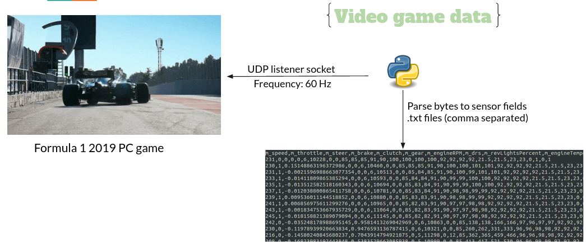
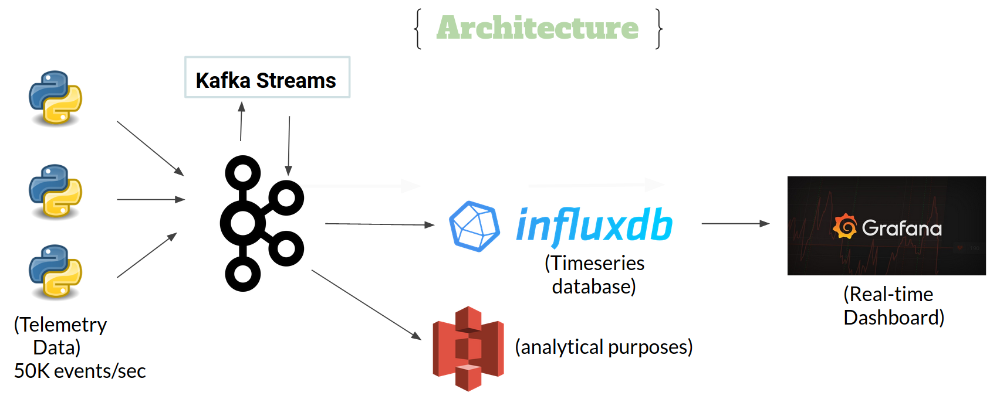
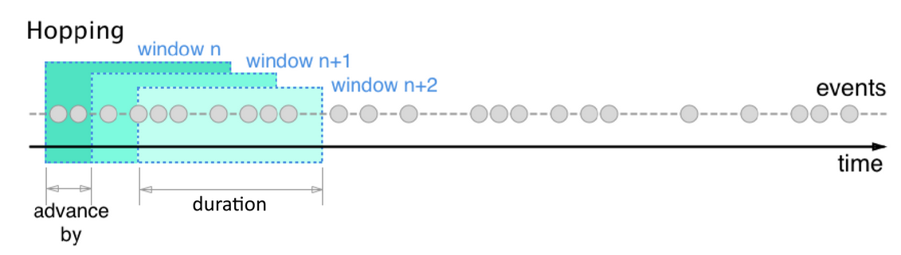
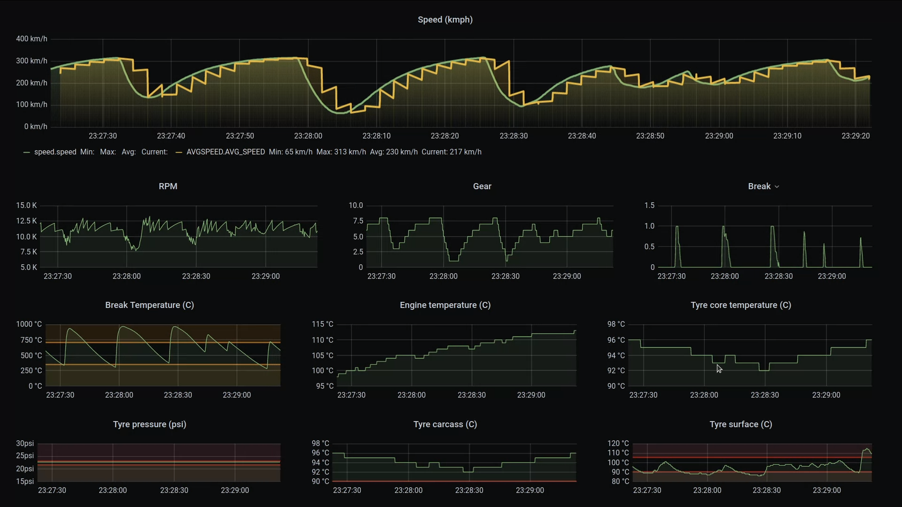
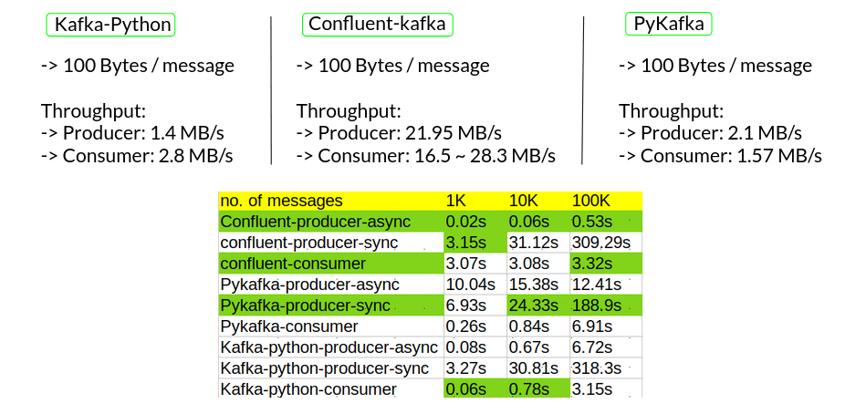
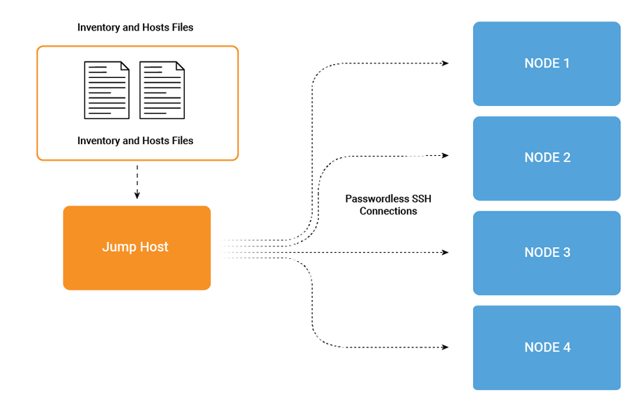

# The-DataFormula
 

 
#### A resilient real-time streaming platform for formula 1 telemetry data
[Presentation Slides](https://docs.google.com/presentation/d/1iVNSijN6hWdmantrVPCrFRSPjSPBr-5AZsMWYGz8bFY)

### Problem
Formula 1 teams spend millions of dollars on proprietary telemetry data platforms. Telemetry data is of huge volume and high velocity. Data generated: 2GB (one lap); 3TB (one race)

### Solution
The goal is to build a resilient data platform that enables real-time decision making (game strategies) and downstream analytics, cutting the cost from millions to thousands of dollars using open source tools.

### Data Challenge
Telemetry data is like a trade secret. Extracted the near real-world telemetry data from Formula 1 PC video game. Code is [here](DataCollection/) <br />
[CodeMaster UDP specification docs](https://forums.codemasters.com/topic/44592-f1-2019-udp-specification/) <br />
Kafka producers are streaming this captured data for two cars of 50 sensors at a rate of 50000 events/sec. <br />
 <br />

### Architecture
- Simplified the architecture for streaming from Kafka and spark to Kafka streams
 <br />
 <br />

***Stream processing***: real-time telemetry observations are streamed by Kafka into Kafka Streams, which handles two tasks: 

 - Hopping window average of speed, it advances by 2s and has a window size of 5s
 
 - Running total of the lap distance <br />
 
 
 
 ### Demo: Grafana Dashboard
 
 [Demo Video](https://youtu.be/gUYPK_-QkPY)
 
 Grafana's minimum refresh rate is 5s. Configured the grafana.ini config file to work for my usecase. Current refresh rate: 1s
<br />



### Benchmarking: Python Kafka Clients
[code](benchmarking) <br />
instance type: m4.large <br />
1 Zookeeper node and 1 Kafka broker with default settings <br />

Confluent-kakfa has the best throughput and scales linearly <br />


### Instructions

#### SET UP CLUSTER:
- (3 nodes) Kafka-Cluster, instance type: m4.xlarge
- (1 node) Influxdb , instance type: i3.large
- (1 node) Jump host/Producer, instance type: t2.medium
- (1 node) Grafana, instance type: m4.large

#### Confluent platform:

- install ansible (2.7 or later)
```bash
sudo apt-add-repository ppa:ansible/ansible
sudo apt-get update
sudo apt-get install ansible
```
- set up keyless SSH between 3 kafka nodes and the jump host
- clone confluent ansible playbook to jump host
```bash
git clone git@github.com:confluentinc/cp-ansible.git
```
- update the private DNS of the confluent platform kafka nodes in hosts.yml
```bash
cp hosts_example.yml hosts.yml
```
- follow this [link](https://docs.confluent.io/current/installation/cp-ansible/ansible-install.html)
```bash
ansible-playbook -i hosts.yml all.yml
```

#### Influxdb
Run on influxdb node
```bash
wget https://dl.influxdata.com/influxdb/releases/influxdb_1.7.7_amd64.deb 
sudo dpkg -i influxdb_1.7.7_amd64.deb
sudo service influxdb start
```

#### Grafana
Run on grafana node
```bash
sudo add-apt-repository "deb https://packages.grafana.com/oss/deb stable main"
sudo apt-get update
sudo apt-get install grafana
sudo systemctl start grafana-server
```

#### Start streaming
Run this on producer node
```bash
python3 bash_scripts/kafka_run.sh
```

#### Consumer scripts
Run this on influxdb node
```bash
python3 bash_scripts/consumer_run.sh
```

### License
[MIT License](LICENSE) <br />
Copyright (c) 2020 Hemanth Devarapati


